# SHINE agency etudes—Plateforme digitale d'accompagnement aux études à l'étranger

##  Présentation

**Shine agency etudes** est une plateforme web développée pour accompagner les étudiants et candidats dans leurs démarches liées aux études à l'étranger.
La solution centralise la présentation des destinations,les services d'accompagnement,les contenus d'information et la gestion des dossiers à travers une interface web moderne et responsive.

Le projet a été pensé autour de trois objectifs :

* simplifier l'accès aux informations pour les candidats ;
* structurer et digitaliser la gestion des dossiers ;
* améliorer la visibilité de la plateforme grâce au référencement naturel.

---

## 🎯 Objectifs du projet

* Concevoir une présence digitale professionnelle pour l'agence.
* Structurer l'information autour des besoins des candidats.
* Présenter clairement les destinations et services proposés.
* Permettre l'inscription de différents profils d'utilisateurs.
* Mettre en place un système de gestion des dossiers clients.
* Fournir un espace d'administration personnalisé.
* Optimiser le site pour le référencement naturel.
* Déployer la solution sur un environnement serveur sécurisé.

---

## 🧩 Architecture de l'information

La conception de l'architecture d'information s'est appuyée sur :

* la modélisation des parcours et de l'organisation des contenus avec **Miro** ;
* l'analyse comparative de solutions et acteurs internationaux (**benchmarking**) ;
* la structuration des contenus selon les besoins des différents profils utilisateurs.

L'objectif était de rendre les informations accessibles rapidement tout en facilitant la conversion des visiteurs en candidats.

---

## 👥 Profils utilisateurs

La plateforme intègre plusieurs parcours adaptés aux différents acteurs :

* **Client / candidat**
* **Apporteur**
* **Mentor**
* **Administration**

Des formulaires d'inscription multi-profils ont été développés afin d'adapter la collecte des informations au rôle de chaque utilisateur.

---

## 🌍 Destinations

La plateforme présente notamment des opportunités d'études dans plusieurs destinations :

* 🇨🇳 Chine
* 🇫🇷 France
* 🇧🇪 Belgique
* 🇨🇦 Canada
* 🇮🇹 Italie
* 🇨🇭 Suisse
* 🇹🇷 Turquie
* 🇨🇾 Chypre

---

## 🛠️ Services présentés

La plateforme permet notamment de présenter différents services d'accompagnement :

* 🎓 Orientation et accompagnement aux études
* 🛂 Accompagnement visa
* 🏠 Recherche de logement
* 🎓 Accompagnement aux bourses
* 🇫🇷 Accompagnement Campus France
* 📚 Informations et actualités liées aux études à l'étranger

---

## ⚙️ Fonctionnalités principales

### Interface publique

* Page d'accueil
* Présentation de l'agence
* Présentation des services
* Présentation des destinations
* Blog / actualités
* Équipe
* Témoignages
* Newsletter
* Formulaire de contact

### Gestion des utilisateurs

* Inscription multi-profils
* Gestion des informations personnelles
* Parcours adaptés selon le profil
* Gestion des dossiers clients

### Administration

* Espace d'administration personnalisé
* Gestion des utilisateurs
* Gestion des dossiers
* Gestion des contenus
* Gestion des services et destinations

---

## 🎨 Interface et expérience utilisateur

L'interface a été conçue avec une approche **minimaliste,responsive et orientée utilisateur**.

Technologies et principes utilisés:

* **Bootstrap 5**
* **Flexbox**
* Responsive Design
* Composants CSS modulaires
* Formulaires structurés
* Adaptation aux différents formats d'écran

L'objectif était d'obtenir une interface professionnelle tout en conservant une navigation simple et intuitive.

---

## 🔎 SEO et stratégie de contenu

Le projet intègre également un travail important sur la visibilité organique.

### Recherche et structuration des contenus

* Identification de mots-clés stratégiques
* Rédaction de contenus structurés
* Organisation des contenus selon l'intention de recherche
* Optimisation des pages pour le référencement naturel

### SEO On-page

* Optimisation des titres et métadonnées
* Structuration des contenus
* Optimisation des éléments sémantiques
* Amélioration de la structure des pages

### Analyse des performances

Le suivi de la visibilité et des performances a été réalisé avec :

* **Google Search Console**
* **Google Analytics 4 (GA4)**

---

## 🗄️ Données et backend

Le backend a été développé avec **Django**.
Le projet repose sur une architecture permettant notamment de gérer :

* les utilisateurs ;
* les différents profils ;
* les dossiers clients ;
* les contenus ;
* les services ;
* les destinations ;
* les formulaires ;
* les données relationnelles.

Une **base de données relationnelle** a été conçue pour structurer les différentes entités et leurs relations.

---

## 🖥️ Déploiement et infrastructure

La solution a été déployée sur un **VPS OVH**.
Infrastructure utilisée :

* **Linux**
* **Nginx**
* **Gunicorn**
* **SSL / HTTPS**
* Git pour la gestion de versions
* Automatisation des sauvegardes système

### Serveur applicatif

Nginx assure notamment le rôle de serveur web et de reverse proxy,tandis que **Gunicorn** assure l'exécution de l'application Django.

### Sécurité

La mise en production comprend notamment :
* configuration HTTPS / SSL ;
* configuration serveur ;
* sécurisation des services ;
* sauvegardes système automatisées.

---

## 📧 Messagerie professionnelle
Une solution de messagerie professionnelle a également été mise en place avec **Google Workspace**.
La configuration comprenait notamment les paramètres DNS nécessaires au fonctionnement et à la sécurisation de la messagerie professionnelle.

---

## 🔧 Technologies utilisées

| Domaine            | Technologies                      |
| ------------------ | --------------------------------- |
| Backend            | Python,Django                    |
| Frontend           | HTML5,CSS3,Bootstrap 5,Flexbox |
| Base de données    | Base de données relationnelle     |
| Versioning         | Git                               |
| Serveur            | Linux,VPS OVH                    |
| Serveur Web        | Nginx                             |
| Application Server | Gunicorn                          |
| Sécurité           | SSL / HTTPS                       |
| Analytics          | Google Analytics 4                |
| SEO                | Google Search Console             |
| Messagerie         | Google Workspace                  |
| Conception         | Miro                              |

---

## 📸 Aperçu

### Accueil
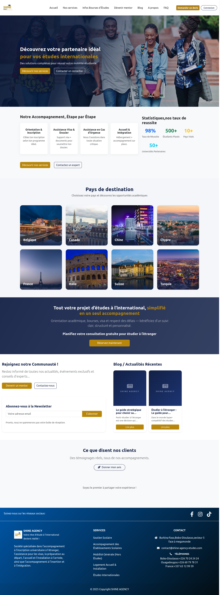

### Services

### Service soutien scolaire
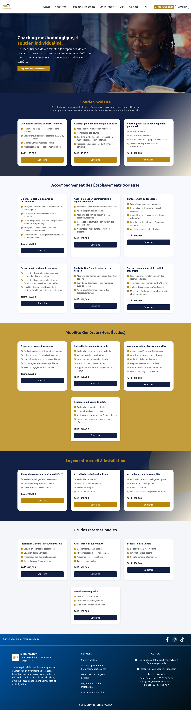
### Exemple de detail de service de soutien scolaire
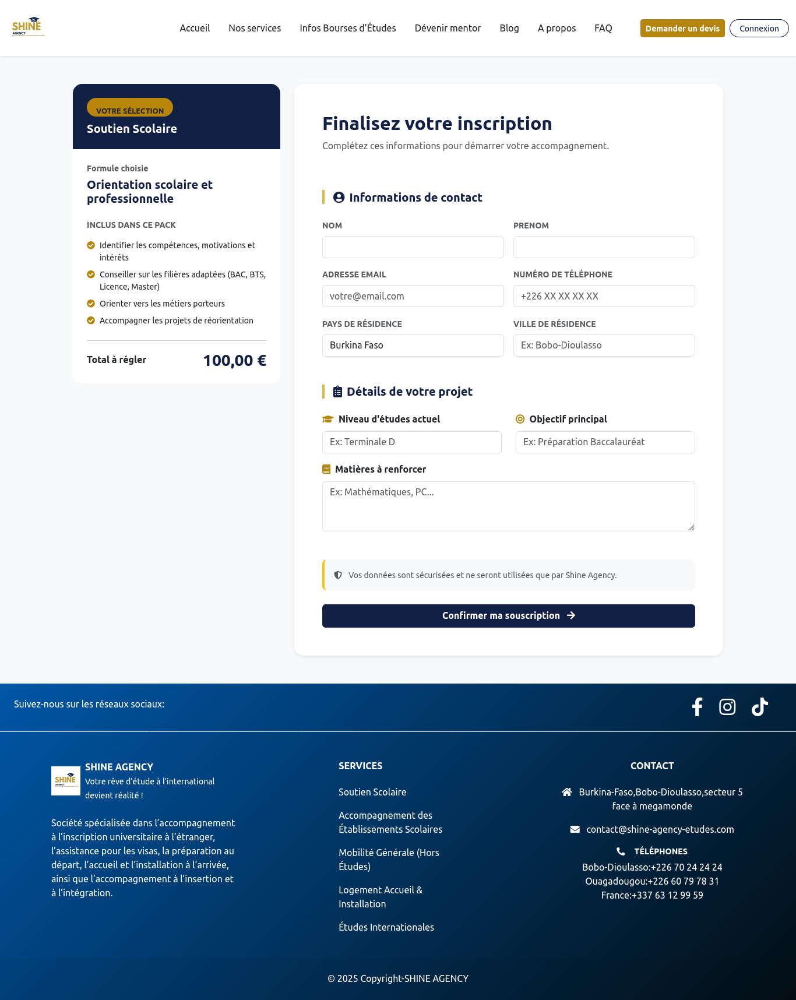

### Service etudes internationales
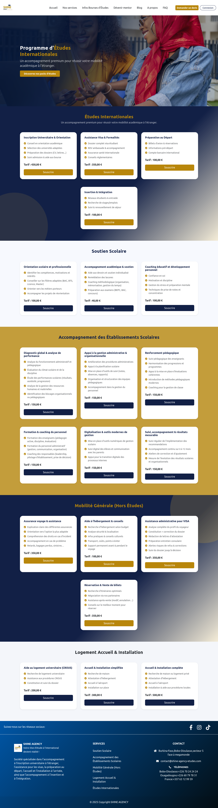
### Service logement,accueil et installation
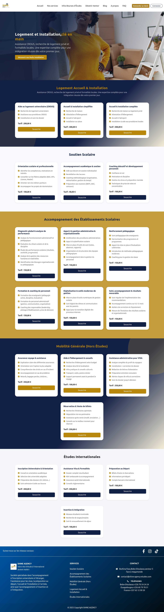
### Service mobilite generale hors etudes
ShineAgency.png)
### Service accompagnement des etablissements scolaires
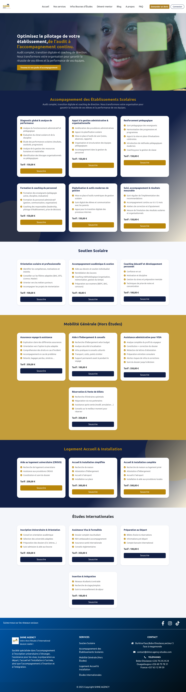

### Bourses
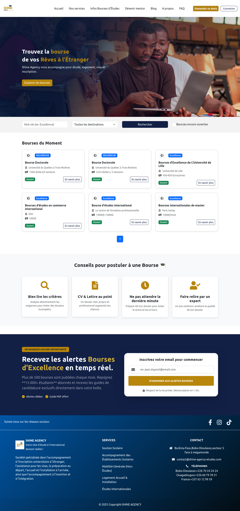

### Mentorat
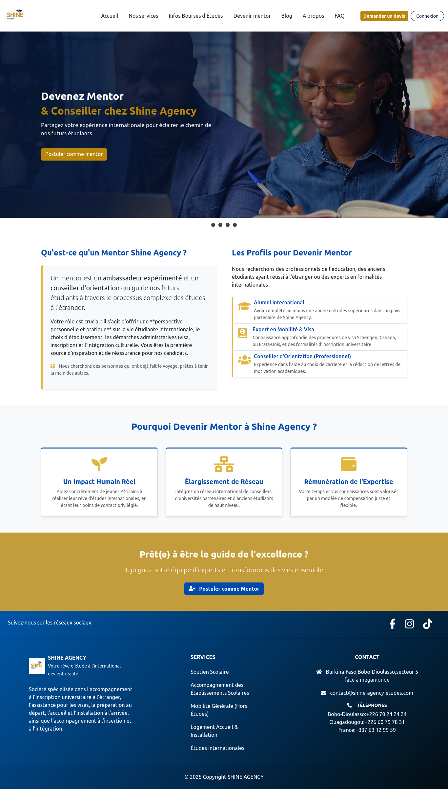

### Blog / Actualités
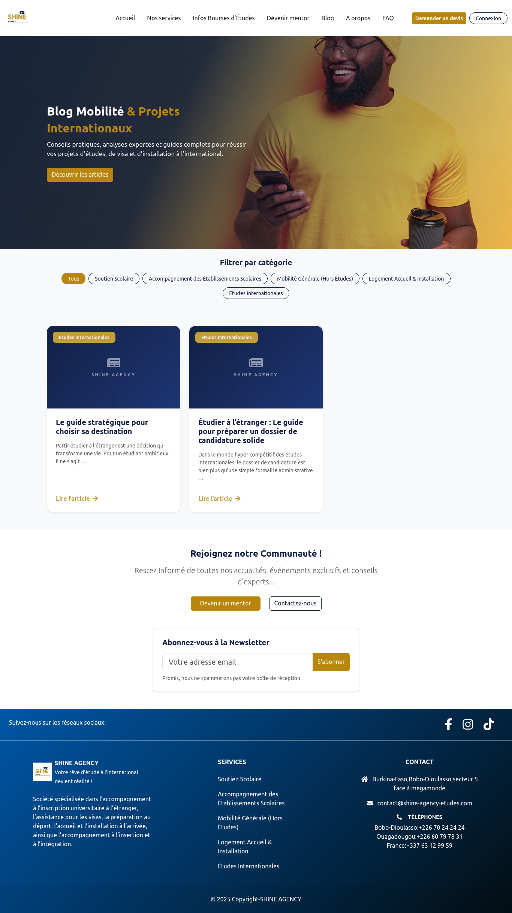

### Blog / Exemple article
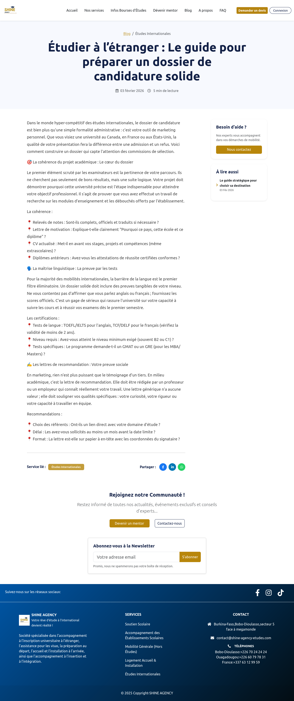

### A Propos
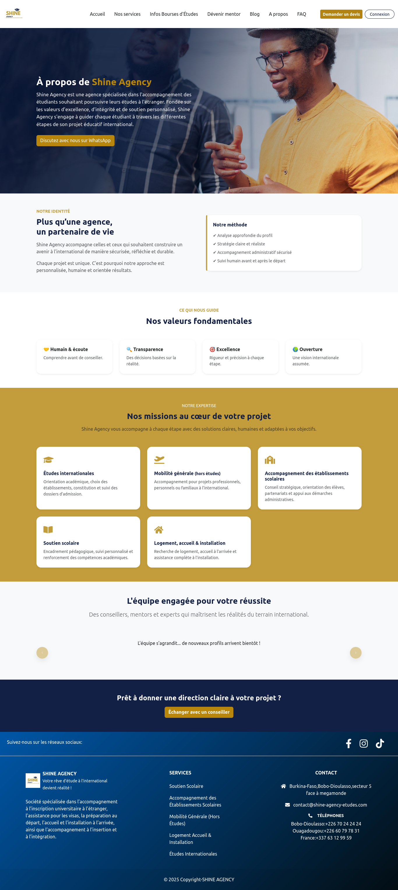
### Contact
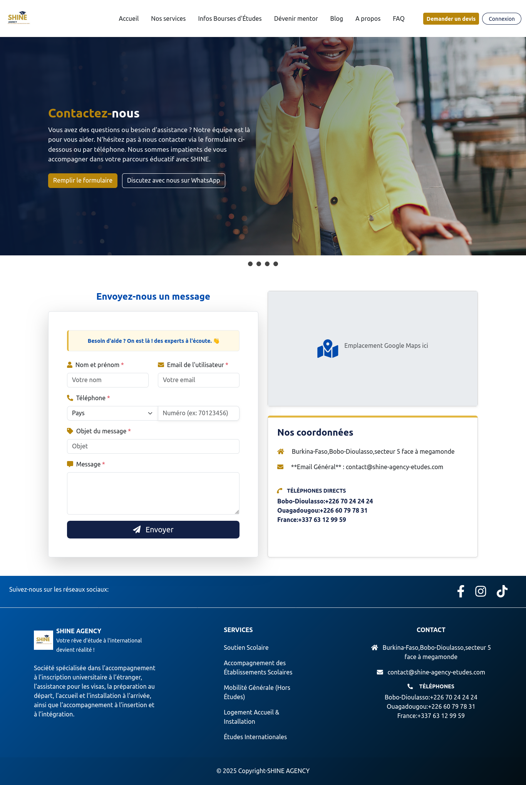
### FAQ
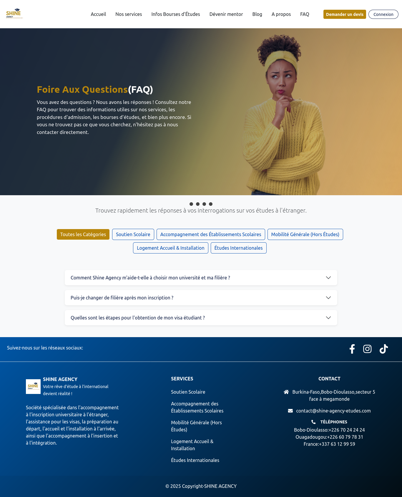
### Demande de devis
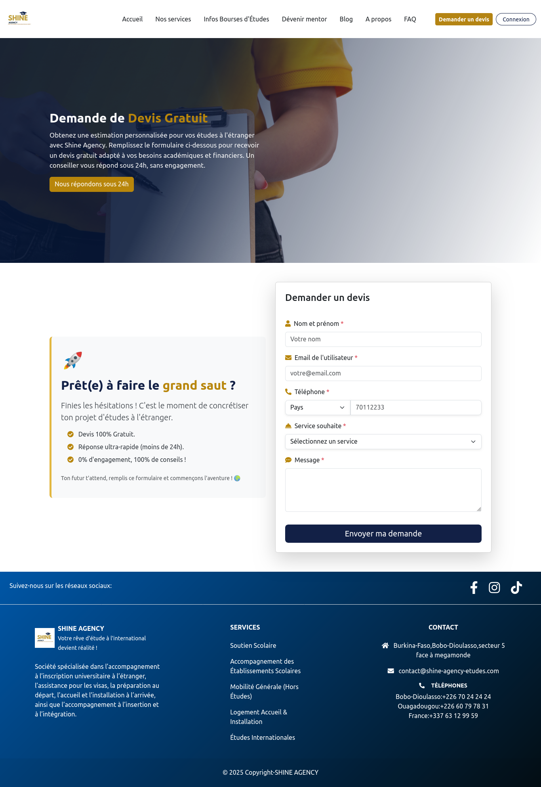
### Connexion-SeConnecter
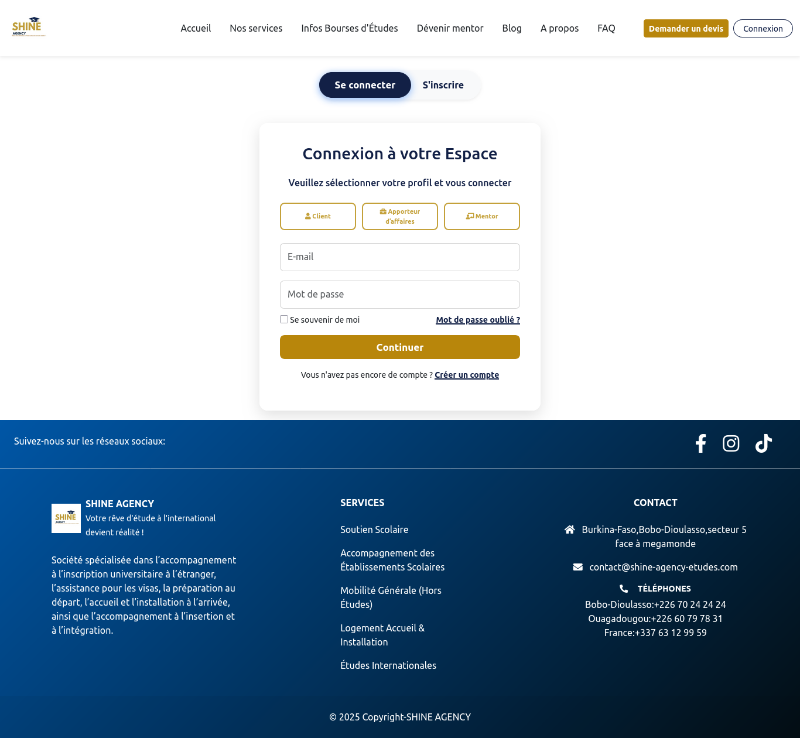
### Connexion-Inscription
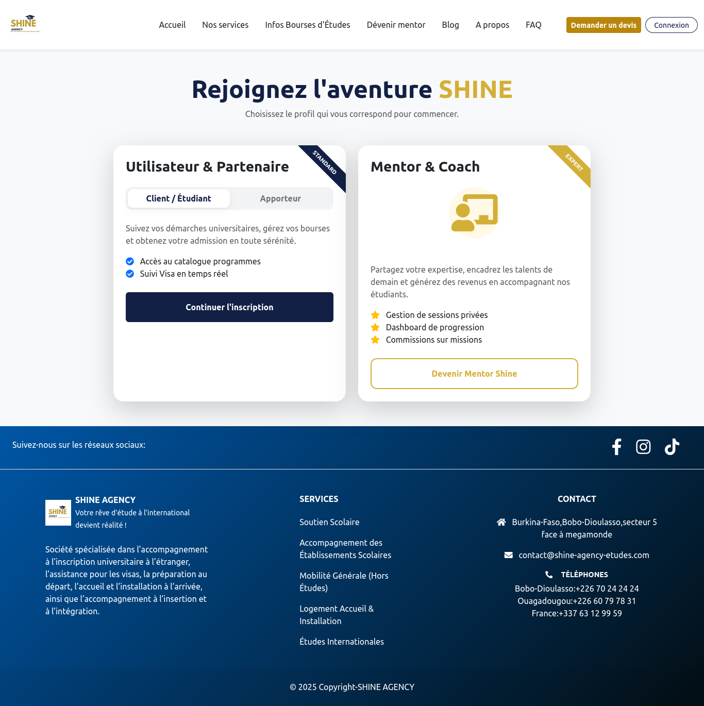
### Inscription d'un mentor
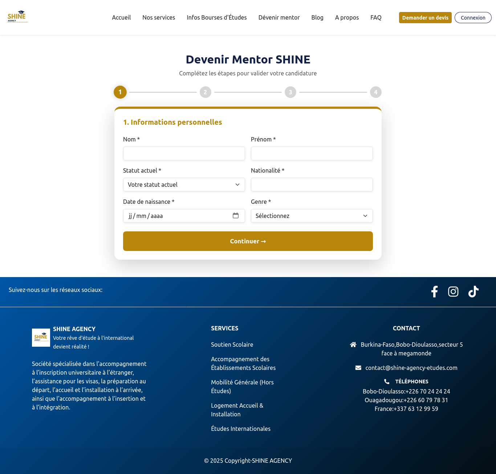

---

## 👨‍💻 Rôle dans le projet

**Développement Web & Référencement**

Interventions sur plusieurs étapes du projet :

* analyse et architecture de l'information ;
* benchmarking ;
* structuration et rédaction des contenus ;
* intégration des maquettes ;
* développement frontend ;
* développement backend avec Django ;
* conception de la base de données ;
* développement des formulaires multi-profils ;
* développement de la gestion des dossiers clients ;
* développement de l'espace d'administration ;
* optimisation SEO ;
* configuration de Google Search Console et GA4 ;
* gestion du versioning avec Git ;
* administration du VPS OVH ;
* configuration Nginx/Gunicorn ;
* sécurisation SSL ;
* automatisation des sauvegardes ;
* configuration de la messagerie professionnelle Google Workspace.

---

## 📂 Confidentialité du code source

Le code source complet de cette réalisation n'est pas publié dans ce dépôt.
Ce repository présente le projet à travers sa **documentation, ses fonctionnalités et des captures d'écran**,afin de présenter la réalisation dans un portfolio professionnel sans exposer les éléments propriétaires ou confidentiels.

---

## 🔗 Projet

🌐 **Site en ligne:** [https://www.shine-agency-etudes.com/]
